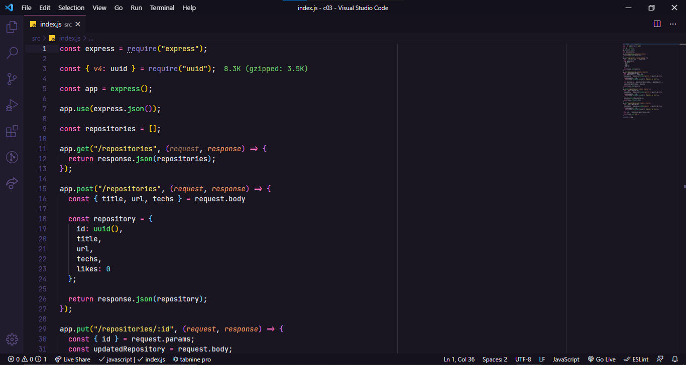

<div>
  
</div>


<br/>

## 📚 Informações sobre o projeto

- Esse projeto foi desenvolvido durante um desafio da rocketseat no Chapter-1 do Ignite, a plataforma Rocketseat disponibilizou o template no qual tinhamos que corrigir o codigo existente e coloca-lo para funcionar.

&nbsp;


## 💻 O que tem no projeto?

- No desafio tinhamos que corrigir o codigo ja existente deixa-lo usável.


## 🛠️ Tecnologias/Ferramentas ultilizadas

- [NodeJs](https://nodejs.org/en/docs/)
- [Express](https://expressjs.com/pt-br/)
- [Uuid](https://www.npmjs.com/package/uuid)
- [Jest](https://testing-library.com/docs/)

## ⚙️ Instalação

```
# Abra um terminal e copie este repositório com o comando
$ git clone https://github.com/Hugovarellaa/ignite-template-react-native-todos
```

```
# Acesse a pasta da aplicação
$ cd ignite-template-react-native-todos

# Instale as dependências
$ yarn

# Inicie o Metro bundler
$ yarn start 

# Depois do emulador aberto
$ yarn android 


```

---

<p align="center">Feito com 💙 por Hugo Alves Varella</p>